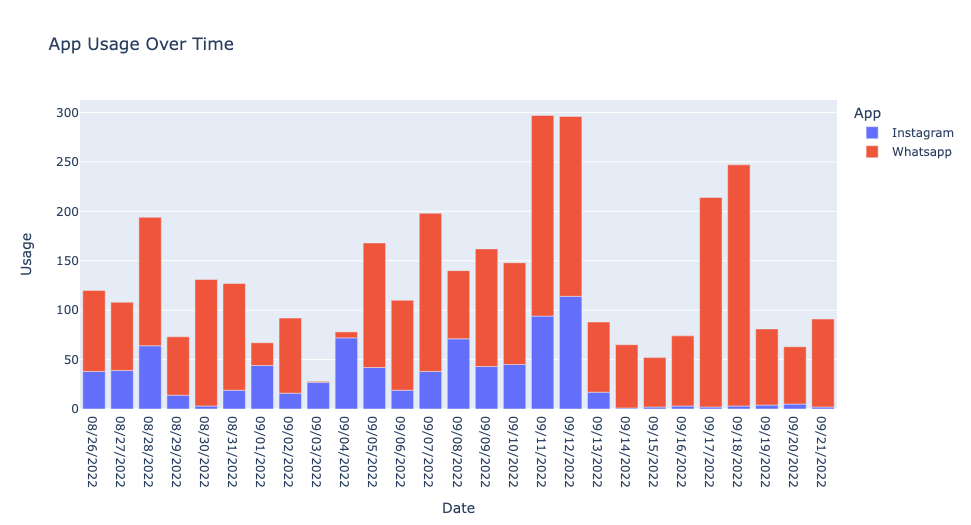
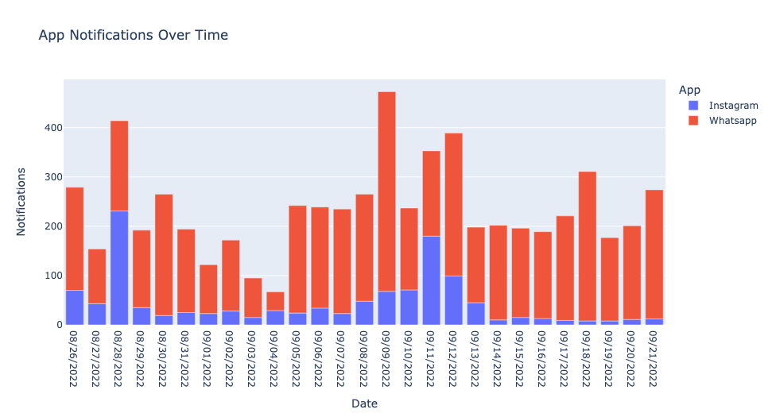
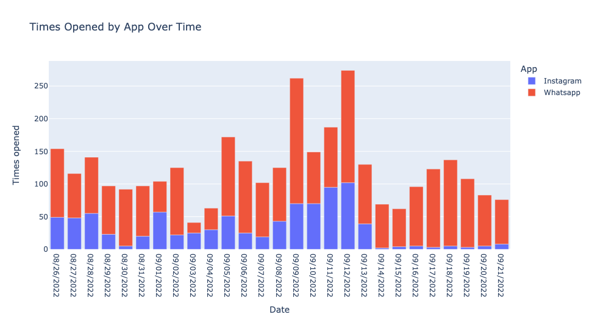
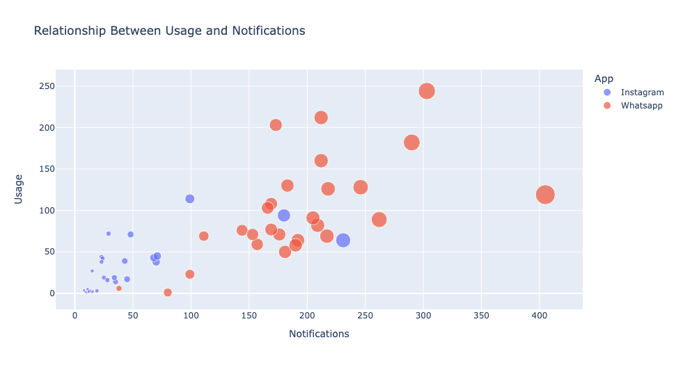
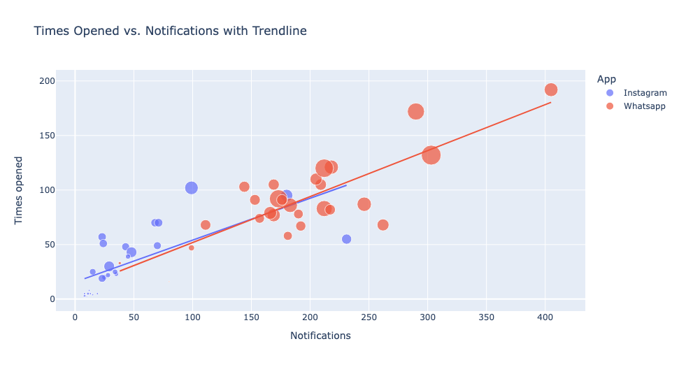

# Screen Time App Analysis

This project analyzes user engagement with various applications based on their screen time, notifications received, and times opened over a specified period. The analysis is visualized using interactive plots created with Plotly.

## Introduction

In today's digital age, understanding how users interact with applications is crucial for developers and marketers. This analysis provides insights into app usage patterns, the impact of notifications on user engagement, and how often users open apps.

## Dataset

The dataset used in this project is `Screentime-App-Details-Dataset.csv`, which contains the following columns:

- **Date**: The date of recording.
- **App**: The name of the application.
- **Usage**: Total screen time spent on the app (in minutes).
- **Notifications**: Number of notifications received from the app.
- **Times opened**: How many times the app was opened.

## Visualization

The following visualizations were created to analyze user behavior:

1. **App Usage Over Time**: A bar plot showing total screen time for each app over the specified dates.
   
     <!-- Replace with the actual path to your plot -->

2. **App Notifications Over Time**: A bar plot illustrating the number of notifications received for each app over time.

     <!-- Replace with the actual path to your plot -->

3. **Times Opened by App Over Time**: A bar plot depicting how many times each app was opened over time.

     <!-- Replace with the actual path to your plot -->

4. **Relationship Between Usage and Notifications**: A scatter plot visualizing the correlation between the number of notifications received and the usage time for each app.

     <!-- Replace with the actual path to your plot -->

5. **Times Opened vs. Notifications with Trendline**: A scatter plot showing the relationship between notifications and times opened, including a trendline for better understanding of the correlation.

     <!-- Replace with the actual path to your plot -->

Here’s a conclusion that ties in the analysis of screen time and user behavior based on your code:

---

## Conclusion

Analyzing screen time through the provided dataset offers valuable insights into user behavior on smartphones. The visualizations illustrate the relationship between app usage, notifications, and interaction frequency, helping both users and smartphone companies understand engagement patterns.

1. **Activity Review**: The bar plots effectively showcase how users allocate their time across various apps, allowing for a clearer assessment of productivity versus time spent on less productive activities.

2. **User Behavior Insights**: The correlation between notifications and app usage suggests that users engage more with apps that frequently notify them, indicating that managing notification settings can enhance productivity and overall user experience.

3. **Informed Decision-Making**: For smartphone companies, understanding these patterns can inform design and marketing strategies aimed at improving user engagement, retention, and satisfaction.

Ultimately, this analysis empowers users to reflect on their smartphone habits, promoting healthier and more productive usage patterns while providing valuable data for companies to enhance their offerings.

--- 

